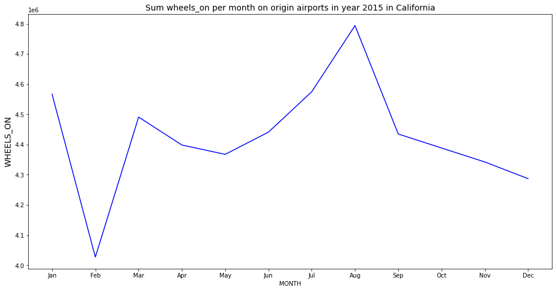
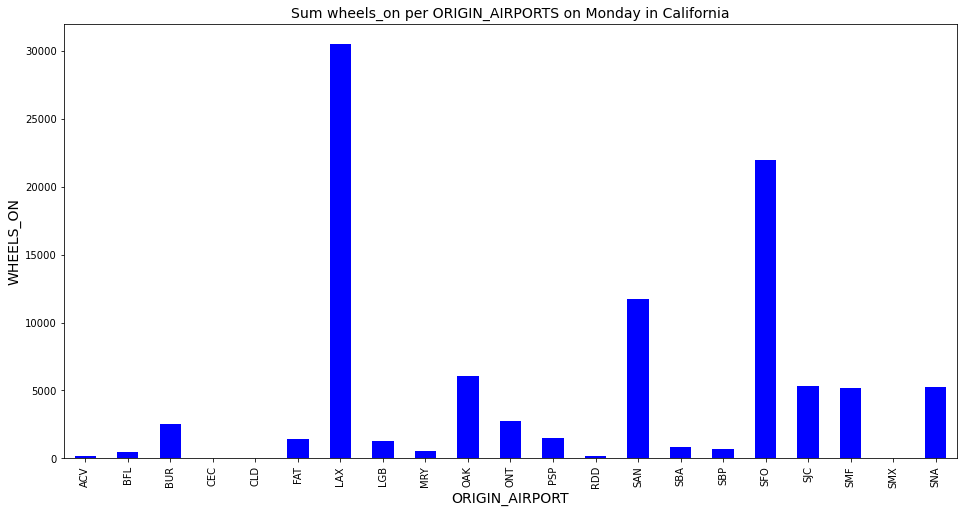
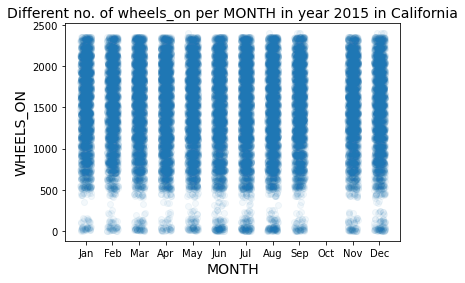
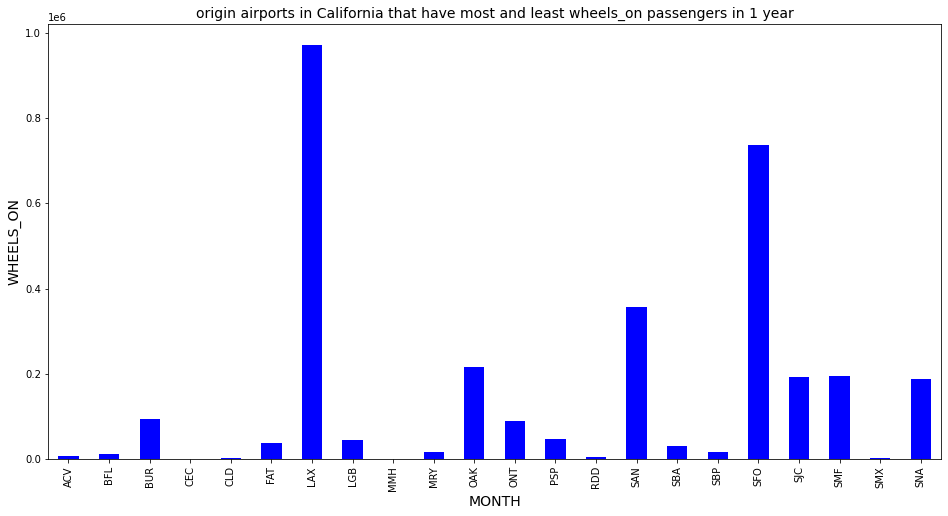

# COMMUNICATE DATA FINDINGS FLIGHTS IN CALIFORNIA

For my analysis I have chosen custom dataset flights.csv and airports.csv  that I have been provided with during Udacity Data Fundamentals Nanodegree. 

This project is divided into two major parts. In the first part, I will conduct an exploratory data analysis on a Flight USA 2015 dataset. I will conduct my analysis in Jupyter notebook using Python and its libraries. Basic cleaning of datasets is made. I will focus my analysis on flights in California state. Jpyter notebook code is provided where questions above are reasearched.

In the second part I will use create a slide deck with several choosen findings.

I have decided to focus my inquiry on data provided for state California. I am interested about wheels_on column. Wheels_on column has number of passengers that are on airplane and will need help from staff after airplane lands (escort by flight attendants, assistance boarding off aircraft,...). All comments in my report will be only for year 2015.

I have researched following questions:

1. How many wheels_on passengers were travelling in California?

We can see declination of wheels_on passengers in February - there were travelling only a little more than 4 million passengers. Highest number of wheels_on passengers was in August, there were almost 4.8 million in total.

2. Which origin airports have most wheels_on passengers on Monday in state California?

Origin_airports with the most wheels_on passengers on all Saturdays in 2015 in California were LAX and SFO.

3. How many WHEELS_ON passengers flights per month were in California?

Every month there are flying from 500 to 2400 whells_on passengers with airlines in California.

4. Which origin airports in California that have  most and least wheels_on passengers?

Origin_airports with most wheels_on passengers is LAX and least wheels_on passengers are ACV, RDD and SMX.# NAND_proj5_Communicate_Data_Findings
